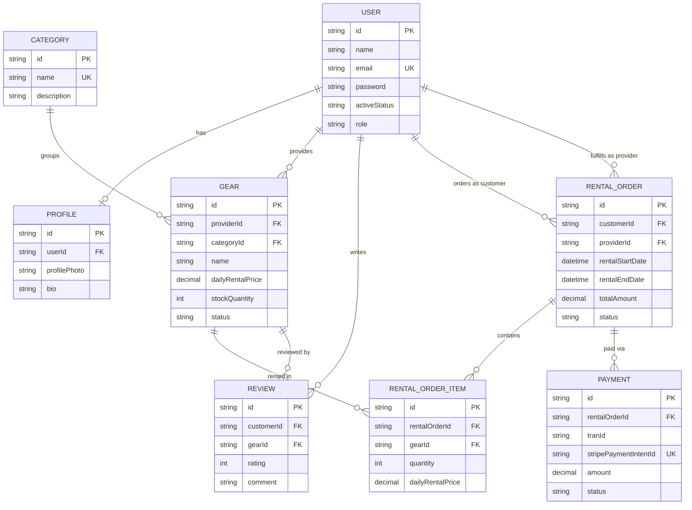

# Database Schema

## Overview

This document describes the database schema for the gear rental platform, based on the Prisma data model.

## Entity Relationship Diagram

```mermaid
erDiagram
  USER ||--o| PROFILE : has
  USER ||--o{ GEAR : provides
  USER ||--o{ REVIEW : writes
  USER ||--o{ RENTAL_ORDER : "orders as customer"
  USER ||--o{ RENTAL_ORDER : "fulfills as provider"
  CATEGORY ||--o{ GEAR : groups
  GEAR ||--o{ RENTAL_ORDER_ITEM : "rented in"
  GEAR ||--o{ REVIEW : "reviewed by"
  RENTAL_ORDER ||--o{ RENTAL_ORDER_ITEM : contains
  RENTAL_ORDER ||--o{ PAYMENT : "paid via"

  USER {
    string id PK
    string name
    string email UK
    string password
    string activeStatus
    string role
  }
  PROFILE {
    string id PK
    string userId FK
    string profilePhoto
    string bio
  }
  CATEGORY {
    string id PK
    string name UK
    string description
  }
  GEAR {
    string id PK
    string providerId FK
    string categoryId FK
    string name
    decimal dailyRentalPrice
    int stockQuantity
    string status
  }
  RENTAL_ORDER {
    string id PK
    string customerId FK
    string providerId FK
    datetime rentalStartDate
    datetime rentalEndDate
    decimal totalAmount
    string status
  }
  RENTAL_ORDER_ITEM {
    string id PK
    string rentalOrderId FK
    string gearId FK
    int quantity
    decimal dailyRentalPrice
  }
  PAYMENT {
    string id PK
    string rentalOrderId FK
    string tranId
    string stripePaymentIntentId UK
    decimal amount
    string status
  }
  REVIEW {
    string id PK
    string customerId FK
    string gearId FK
    int rating
    string comment
  }
```

