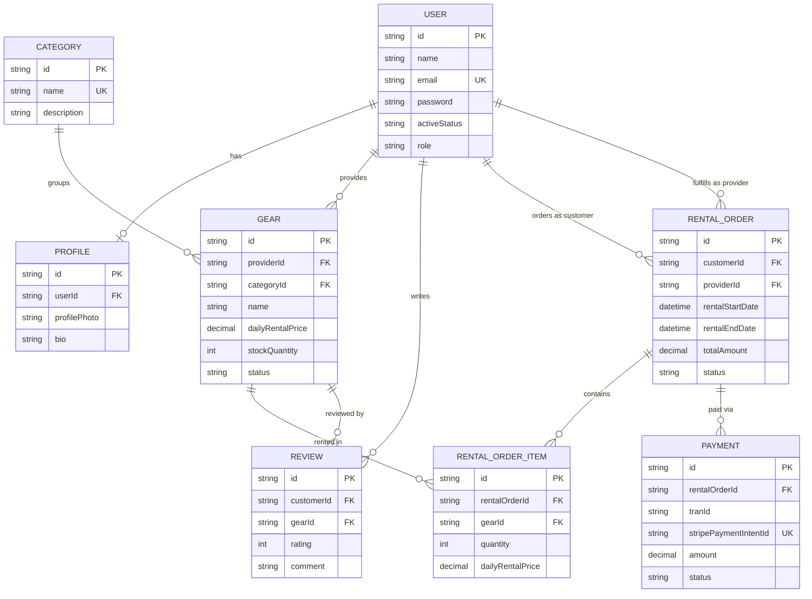

# Database Schema

## Overview

This document describes the database schema for the gear rental platform, based on the Prisma data model.

## Entity Relationship Diagram

## Models

### User

Represents a platform account. A user can hold the role `CUSTOMER`, `PROVIDER`, or `ADMIN`.

| Field | Type | Notes |
|---|---|---|
| id | String | Primary key, UUID |
| name | String | |
| email | String | Unique |
| password | String | |
| activeStatus | ActiveStatus | `ACTIVE` \| `SUSPEND`, default `ACTIVE` |
| role | Role | `CUSTOMER` \| `PROVIDER` \| `ADMIN`, default `CUSTOMER` |
| createdAt | DateTime | |
| updatedAt | DateTime | |

**Relations**
- `profile` — one-to-one with `Profile`
- `gears` — one-to-many with `Gear` (as provider)
- `reviews` — one-to-many with `Review` (as customer)
- `customerOrders` — one-to-many with `RentalOrder` (as customer)
- `providerOrders` — one-to-many with `RentalOrder` (as provider)

### Profile

Extended profile information for a `User`.

| Field | Type | Notes |
|---|---|---|
| id | String | Primary key, UUID |
| profilePhoto | String? | |
| bio | String? | |
| userId | String | Unique, references `User.id` |
| createdAt | DateTime | |
| updatedAt | DateTime | |

**Relations**
- `user` — one-to-one with `User`

### Category

Classification for `Gear` items.

| Field | Type | Notes |
|---|---|---|
| id | String | Primary key, UUID |
| name | String | Unique |
| description | String? | |
| createdAt | DateTime | |
| updatedAt | DateTime | |

**Relations**
- `gears` — one-to-many with `Gear`

### Gear

A rentable item listed by a provider.

| Field | Type | Notes |
|---|---|---|
| id | String | Primary key, UUID |
| providerId | String | References `User.id` |
| categoryId | String | References `Category.id` |
| name | String | |
| description | String? | Text |
| brand | String? | |
| model | String? | |
| imageUrl | String? | |
| dailyRentalPrice | Decimal | (10,2) |
| stockQuantity | Int | Default `0` |
| status | GearStatus | `ACTIVE` \| `INACTIVE`, default `ACTIVE` |
| createdAt | DateTime | |
| updatedAt | DateTime | |

**Indexes**: `providerId`, `categoryId`

**Relations**
- `provider` — many-to-one with `User`
- `category` — many-to-one with `Category`
- `orderItems` — one-to-many with `RentalOrderItem`
- `reviews` — one-to-many with `Review`

### RentalOrder

An order placed by a customer against a provider.

| Field | Type | Notes |
|---|---|---|
| id | String | Primary key, UUID |
| customerId | String | References `User.id` |
| providerId | String | References `User.id` |
| rentalStartDate | DateTime | |
| rentalEndDate | DateTime | |
| totalAmount | Decimal | (10,2) |
| status | RentalOrderStatus | `PLACED` \| `CONFIRMED` \| `PAID` \| `PICKED_UP` \| `RETURNED` \| `CANCELLED`, default `PLACED` |
| note | String? | |
| createdAt | DateTime | |
| updatedAt | DateTime | |

**Indexes**: `customerId`, `providerId`, `status`

**Relations**
- `customer` — many-to-one with `User`
- `provider` — many-to-one with `User`
- `items` — one-to-many with `RentalOrderItem`
- `payment` — one-to-many with `Payment`

### RentalOrderItem

A line item within a `RentalOrder`.

| Field | Type | Notes |
|---|---|---|
| id | String | Primary key, UUID |
| rentalOrderId | String | References `RentalOrder.id`, cascade delete |
| gearId | String | References `Gear.id` |
| quantity | Int | |
| dailyRentalPrice | Decimal | (10,2) |
| createdAt | DateTime | |

**Indexes**: `rentalOrderId`, `gearId`

**Relations**
- `rentalOrder` — many-to-one with `RentalOrder`
- `gear` — many-to-one with `Gear`

### Payment

A payment record tied to a `RentalOrder`, integrated with Stripe.

| Field | Type | Notes |
|---|---|---|
| id | String | Primary key, UUID |
| tranId | String | |
| rentalOrderId | String | References `RentalOrder.id`, cascade delete |
| stripePaymentIntentId | String | Unique |
| amount | Decimal | (10,2) |
| currency | String | Default `"bdt"` |
| status | PaymentStatus | `PENDING` \| `COMPLETED` \| `FAILED`, default `PENDING` |
| paidAt | DateTime? | |
| createdAt | DateTime | |
| updatedAt | DateTime | |

**Indexes**: `status`

**Relations**
- `rentalOrder` — many-to-one with `RentalOrder`

### Review

A customer's review of a `Gear` item.

| Field | Type | Notes |
|---|---|---|
| id | String | Primary key, UUID |
| customerId | String | References `User.id`, cascade delete |
| gearId | String | References `Gear.id`, cascade delete |
| rating | Int | |
| comment | String? | Text |
| createdAt | DateTime | |
| updatedAt | DateTime | |

**Unique constraint**: `[customerId, gearId]`

**Indexes**: `gearId`, `customerId`

**Relations**
- `customer` — many-to-one with `User`
- `gear` — many-to-one with `Gear`

## Enums

| Enum | Values |
|---|---|
| ActiveStatus | `ACTIVE`, `SUSPEND` |
| Role | `CUSTOMER`, `PROVIDER`, `ADMIN` |
| GearStatus | `ACTIVE`, `INACTIVE` |
| RentalOrderStatus | `PLACED`, `CONFIRMED`, `PAID`, `PICKED_UP`, `RETURNED`, `CANCELLED` |
| PaymentStatus | `PENDING`, `COMPLETED`, `FAILED` |
